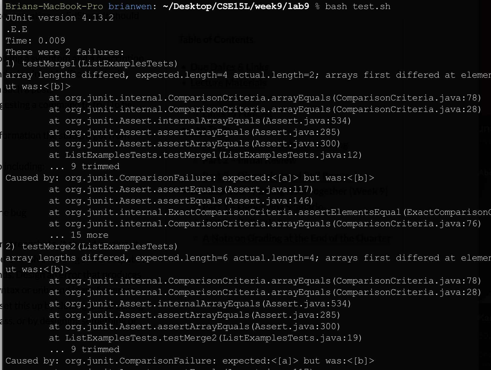
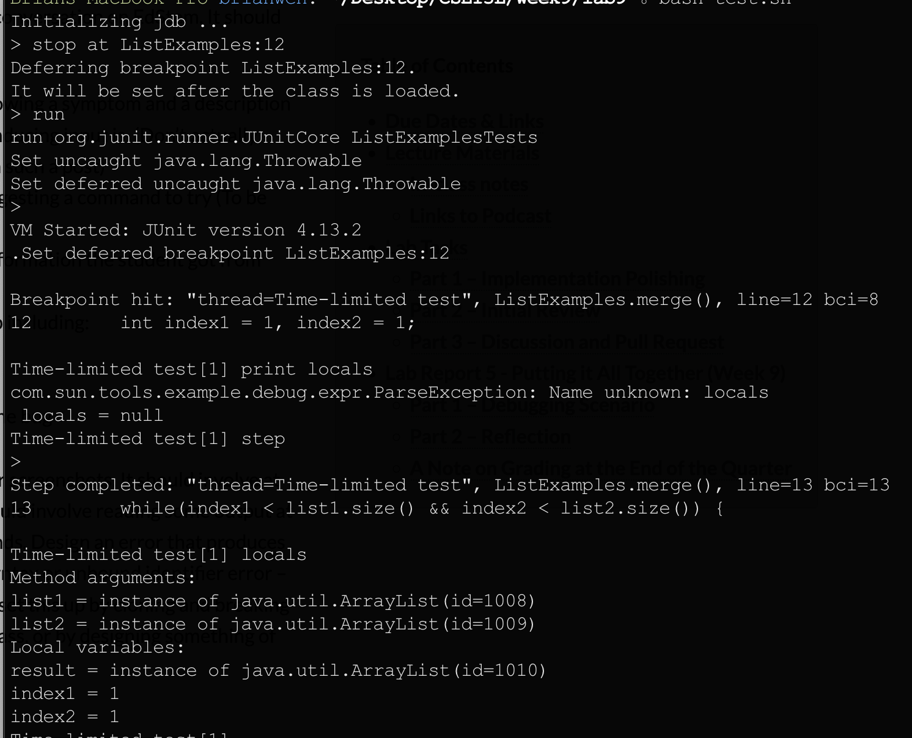
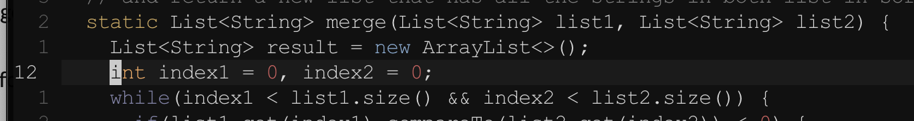
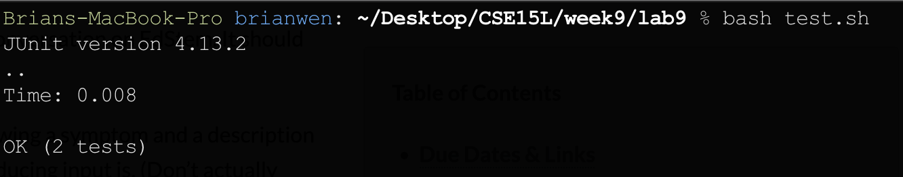

# Lab Report 5

## Part 1 - Debugging Scenario 

1. A student comes to the TA with JUnit error output. JUnit is called in the file `ListExampleTests.java`. The student has a bash script that complies the java files with the `-g` option so that we can debug with jdb, and then runs the test java class. Because the JUnit output shows that the array lengths are incorrect by 2, the student guesses that the error has to do with incorrect array indexing. 



2. The TA suggests to the the student to change the bash file to run with jdb. After starting jdb up, the TA suggests to set a breakpoint at the firstpoint where index1 or index2 is set. After that make sure that those values are corretly set and to keep in mind that array indexes start at 0 and not 1.


3. Below is the output of running jdb from the bash script as the TA suggested. The student chooses to set a breakpoint at `ListExamples.java:12`. At that point they run `locals` within jdb to realize that the initial values are incoreectly set to the second value stored in the array and not the first. The student discovers that those two variables should be set to 0 instead of 1 on line 12. 



4. Screenshot of fixing the bug on line 12:



After chaging the bash script back so that the program runs normally, we see from the JUnit output to the command line that both tests have passsed successfuly. The file directory structure must contain a folder `lib` which contains the file for JUnit to run. 




## Part 2 - Reflection
Something I learned the second half of the quarter was to do do things directly from the command line without help from a graphical user interface. This was mostly done with the command prompt commands and learning Vim. With Vim, I can quickly edit text from the terminal. Furhthermore, there are commands that I can run in vim that make it personalized to my preferences while coding, such as showing line numbers, syntax-highlighting, and and editing the behavior of certain key-presses. There are commands for quick movement around the text file and to make edits to it as well. Furthermore, I was able to explore more to learn about the `.vimrc` file which will run a set of commands everytime you open up Vim. This way, Vim is quickly configured for the way that is most convenient for me to use. Another thing that I learned in the second half of the quarter was how to step through the program using a debugger and how to find the values of variables are specific location in the program determined by breakpoints. 


### `ListExamples.java` (fixed bug)
```
import java.util.ArrayList;
import java.util.List;

interface StringChecker { boolean checkString(String s); }

class ListExamples {

  // Takes two sorted list of strings (so "a" appears before "b" and so on),
  // and return a new list that has all the strings in both list in sorted order.
  static List<String> merge(List<String> list1, List<String> list2) {
    List<String> result = new ArrayList<>();
    int index1 = 0, index2 = 0;
    while(index1 < list1.size() && index2 < list2.size()) {
      if(list1.get(index1).compareTo(list2.get(index2)) < 0) {
        result.add(list1.get(index1));
        index1 += 1;
      }
      else {
        result.add(list2.get(index2));
        index2 += 1;
      }
    }
    while(index1 < list1.size()) {
      result.add(list1.get(index1));
      index1 += 1;
    }
    while(index2 < list2.size()) {
      result.add(list2.get(index2));
      // change index1 below to index2 to fix test
      index2 += 1;
    }
    return result;
  }


}

```

### `ListExamplesTests.java`
```
import static org.junit.Assert.*;
import org.junit.*;
import java.util.*;
import java.util.ArrayList;


public class ListExamplesTests {
	@Test(timeout = 500)
	public void testMerge1() {
    	List<String> l1 = new ArrayList<String>(Arrays.asList("x", "y"));
		List<String> l2 = new ArrayList<String>(Arrays.asList("a", "b"));
		assertArrayEquals(new String[]{ "a", "b", "x", "y"}, ListExamples.merge(l1, l2).toArray());
	}
	
	@Test(timeout = 500)
        public void testMerge2() {
		List<String> l1 = new ArrayList<String>(Arrays.asList("a", "b", "c"));
		List<String> l2 = new ArrayList<String>(Arrays.asList("c", "d", "e"));
		assertArrayEquals(new String[]{ "a", "b", "c", "c", "d", "e" }, ListExamples.merge(l1, l2).toArray());
        }

}

```