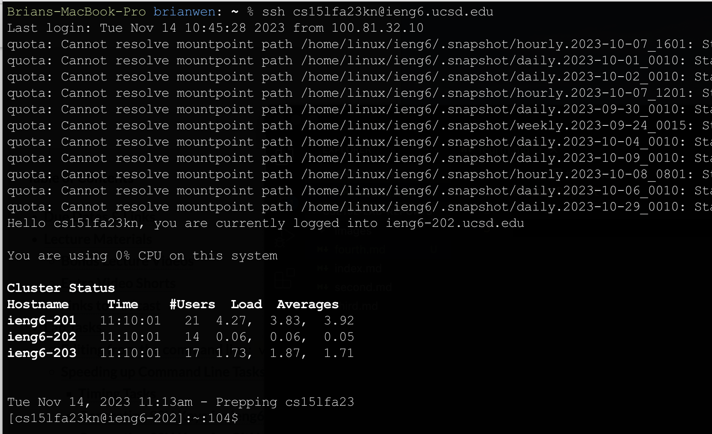
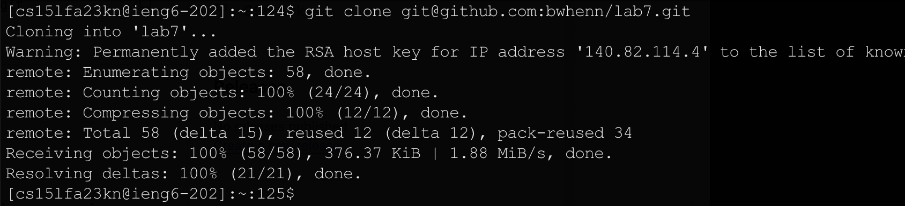
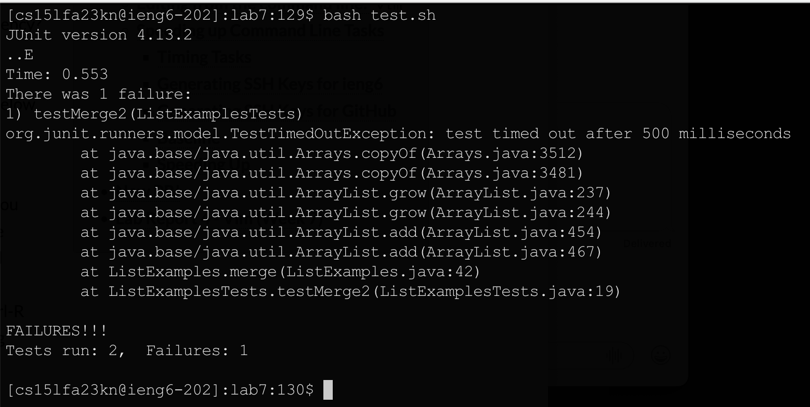
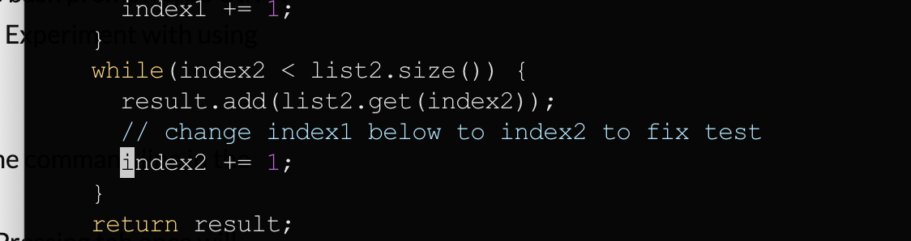
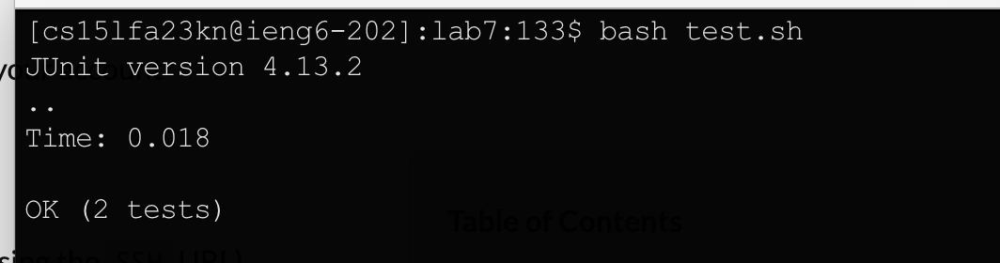
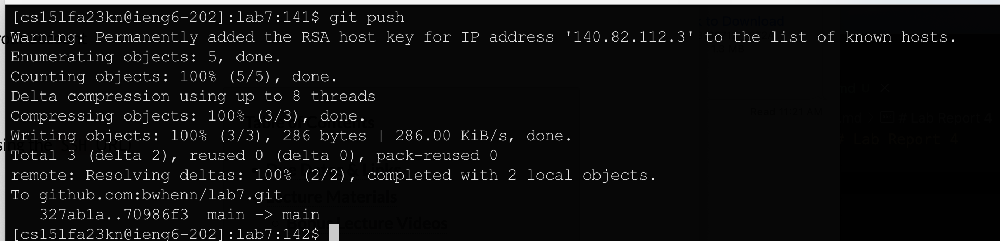

# Lab Report 4

### 1. Step 4

-   Keypresses: ssh\<space>cse15lfa23kn@ieng6.ucsd.edu\<enter>
-   Login to ieng6 using linux `ssh` command with host ieng6.ucsd.edu . Becasue I have previously set up passwordless login, there is no password required to log into the system from the terminal on my local machine. 

### 2. Step 5

-    Keypresses: git\<space>clone\<space>Cmd+v\<enter>
* Use `git clone <repo_url>` to clone a respsity from a remote repository which can be accesed through URL. In this case, we are using a SSH clone url provided by GitHub, since ieng6 now has the SSH key which enables it to both clone and push. The clone link was stored in the OS clipboard, so I used Cmd+v to paste it. 

### 3. Step 6

-    Keypresses: bash\<space>test.sh\<enter>
* To run a bash script, use `bash <file_name>` where `file_name` represents of the name of the bash script to be run. Notice that we are in the same directory that contains the bash script being run. This run of the tests show that there is a bug in the code and the expected output is not provided. 

### 4. Step 7

-    Keypresses: vim\<space>Lis\<tab>\<enter>:44ea\<delete>2:wq
* After entering vim, we can use `:44` to quickly move to the 44th line. After wards, we can use `e` followed by `a` to move to the end of the first word while switching to insert mode. Afterwords, we delete the incorrect "1", replace it with "2", and the use `:wq` to save and quit vim.   

### 5. Step 8

    - Keypresses: \<up>\<up>\<enter>
* Becasue this is the same command that was used two commands ago, we can save some time by using the up arrow to traverse the history of commands run and run a certain command again. With the fixed bug, there are not bugs to report from JUnit. 

### 6. Step 9

    - Keypresses: 
* git\<space>add\<space>ListE\<tab>\<enter>
* git\<space>commit\<space>-m\<space>"fixed\<space>index2"\<enter>
* git\<space>push\<enter>
* After this series of git add, commit, and push from the command line, the repository changes are "pushed" to match the respository hosted on the remote, which in this case is GitHub. 
    

