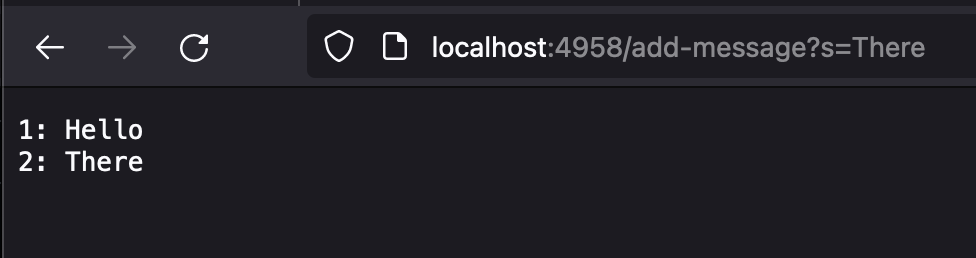
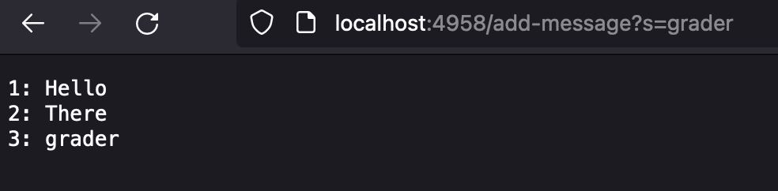
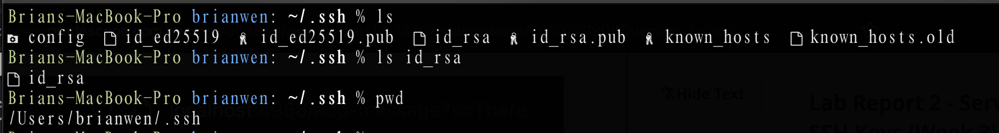
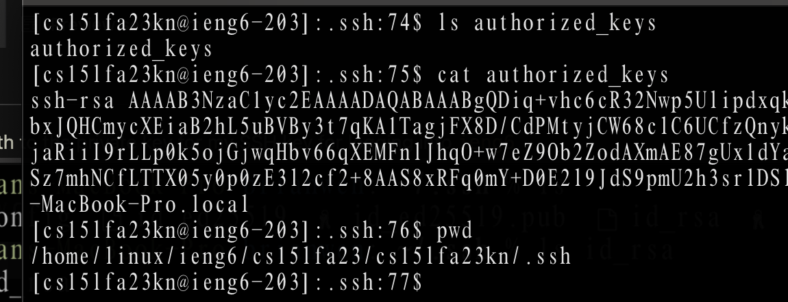
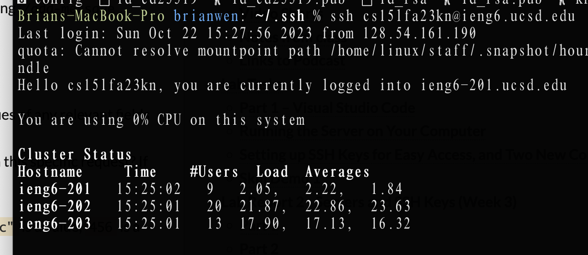

# Lab Report 2 

## Part 1
#### StringServer Code 
```
import java.io.IOException;
import java.net.URI;


class Handler implements URLHandler {
    String showString = "";
    int count = 1; 

    public String handleRequest(URI url) {
        if (url.getPath().equals("/")) {
            return String.format("Welcome");
        }
        else if (url.getPath().contains("/add-message")) {
            String[] params = url.getQuery().split("=");
            if (params[0].equals("s")) {
                showString = showString.concat(String.format("%d: ", count));
                showString = showString.concat(params[1]);
                showString = showString.concat("\n");
                count++;
            }
            return showString;
        }
        return "404 not Found!";
    }
}

class StringServer {
    public static void main(String args[]) throws IOException {
        if (args.length == 0) {
            System.out.println("Missing port number! Try any number between 1024 to 49151");
            return; 
        }
        int port = Integer.parseInt(args[0]);
        Server.start(port, new Handler());
    }
}
```

In this image, the variables `showString` (string) and `count` (int) are initialized when the server is first started during creation of the new  `Handler` object in  `main`. When we update the URL with `<domain>/add-message?s=There`, the string "there" is concatenaed to `showString` before the incremented  `count` variable. Then, a new line character is concatenated so that the next string to be added will begin on a new line. When the page is reloaded with the updated URL, the method `handleRequest()` of the class `Handler` is called. 


In this image, the `showString` variable has been updated once again as `handleRequest()` is called again when I reloaded the browser page with and updated url `<domain>/add-message?s=There`. Now that I have run these methods twice with different string inputs, the page displays a list of currently loaded strings in numerical order. 

## Part 2
* The path to the private key for my SSH key for logging into  `ieng6`

* The path to the public key for my SSH key for logging into  `ieng6`

* A terminal interaction where I log into `ieng6` with my course-specific account without being asked for a password.


## Part 3
Something I learned this week is that the Java language can be used to set up a server that can be accesed from any computer's browser so long as it has an internet connection. Furthermore, there are methods such as `getPath()` and `getQuery()` to make URL parsing easier. Furthermore, I learned that servers can also be hosted locally and can then be accesed from a browser using localhost. Lastly, realized that servers are akin to remote computers whos information can be accesed and manipulated by non-local users. 
