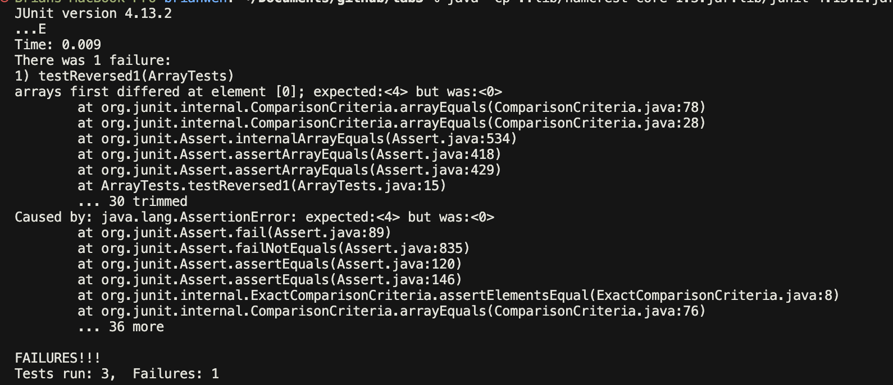
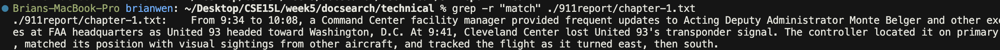
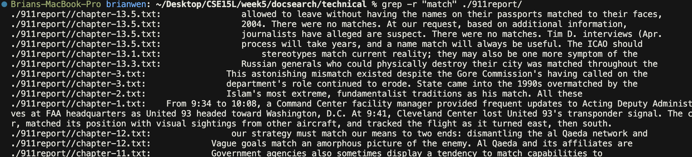
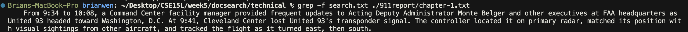
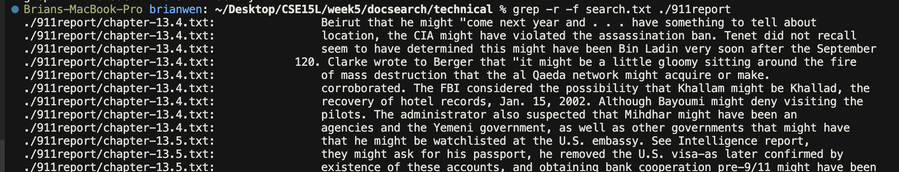
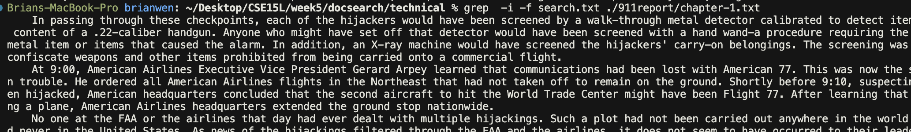
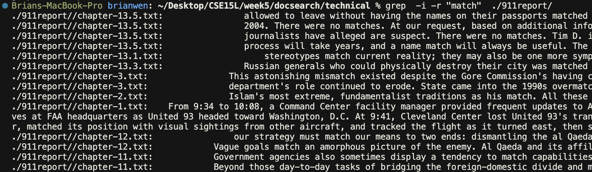
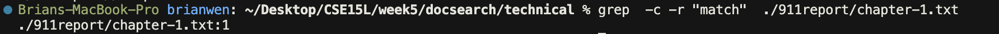
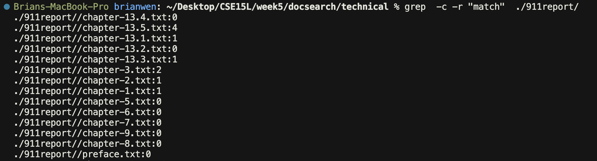

# Lab Report 3

## Part 1

1. A failure-inducing input for `reversed()`
```
@Test 
public void testReversed1() {
    int[] input1 = { 1, 2, 3, 4 };
    assertArrayEquals(new int[]{4, 3, 2, 1}, ArrayExamples.reversed(input1));
}
```

2. An input that doesn’t induce a failure for `reversed()`
```
@Test
    public void testReversed() {
    int[] input1 = { 0};
    assertArrayEquals(new int[]{ 0}, ArrayExamples.reversed(input1));
}
```

3. The symptom


4. The bug

    - The code before 
    ```
    static int[] reversed(int[] arr) {
        int[] newArray = new int[arr.length];
        for(int i = 0; i < arr.length; i += 1) {
            arr[i] = newArray[arr.length - i - 1];
        }
        return arr;
    }
    ```
    - The code after 
    
    The code below fixes the error by fixing the LValue and RValue of the assignment statemtn in the for loop. The array being referenced on the right hand side should be the array that is passed as a parameter (`arr`), instead of the array that has been newly created (`newArray`). Additionaly, the array being mutated should be the newly created array (`newArray`). Finally, the array being returned should be the newly reversed array, instead of the same array that was passed to the function. 
    ```
    static int[] reversed(int[] arr) {
        int[] newArray = new int[arr.length];
        for(int i = 0; i < arr.length; i += 1) {
            newArray[i] = arr[arr.length - i - 1];
        }
    return newArray;
    }
    ```


## Part 2 

### The `grep` command 
#### Alternate options for using `grep`
1. `-r`
    - On a file
     
     When a filename is pased to `grep` and the recursive option is selected, `grep` will behave the same way as without the recursive option becasue there is no nested subdirectory to search. 

     

    - On a directory 
    
    On the other hand, when a directory is passed and the recursive option is selected, `grep` will search thorugh all files and subdirectories within the directory for lines of text that match `PATTERN`

     

 2. `-f`
    - On a file 

    When `-f` is used along with two source files following, `grep` will print lines in second file that match with lines in the first file. 

    

    - On a directory

    When used on a directory, we must use the `-r` command to search through the directories nested files. Every line that matches a line in `search.txt` will be printed to the terminal.
 
    

3. `-i`
    - On a file 
    
    The `-i` option makes it so that pattern matching is not case sensitive. 

    

    - On a directory

    The behavior is the same when used on a directory, but `-r` must also be specified to search though its nexted files. 

    

4. `-c`
    - On a file 

    The `-c` option will print the number of lines in the file that match the given `PATTERN`.

    

    - On a directory

    The behavior is the same when used on a directory, but `-r` must also be specified to search though its nexted files. So the number of matching lines in each file nexted within the directory will be printed to the terminal

    